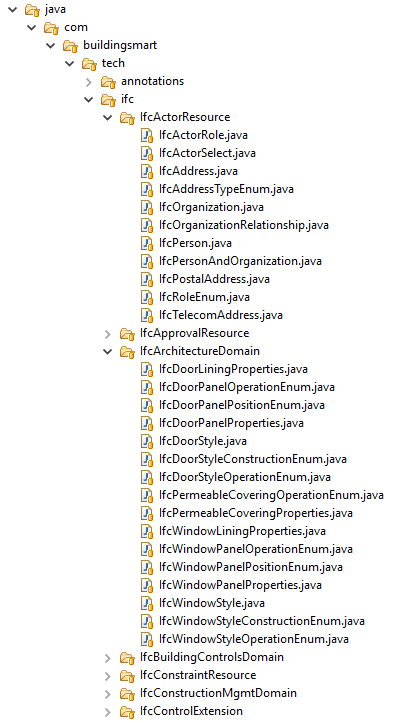
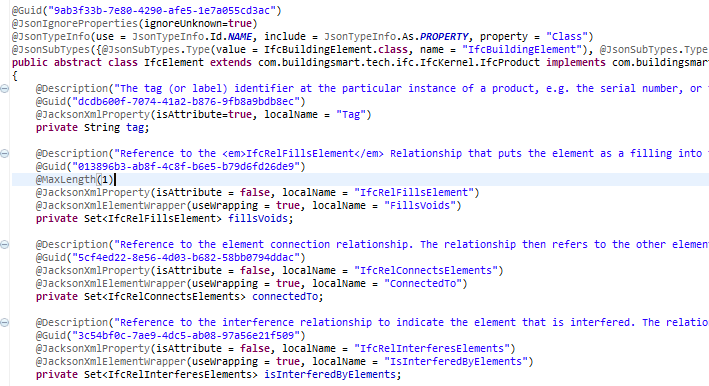

# IFC.JAVA

## What?
This repository contains all IFC entities in the form of a Java class library. It contains all the classes provided in the IFC EXPRESS schema, but in a JAVA syntax. Hence, these IFC classes can be used directly for working with IFC data in JAVA.



The code allows serialising and deserialising IFC objects to XML and JSON using out of the box annotations (Jackson package). IFC-SPF (STEP) is not supported. We suggest exporting building data in the right syntax directly from any BIM tool using scripts, native APIs, Dynamo scripts or other. Resulting JSON and XML can be loaded directly into this Java code library; and then the data can be used.



## Why?
IFC is a common data model in the AEC industry. Many starting developers and PhD students consider using IFC to obtain data. Yet, parsing IFC STEP files (.ifc) is cumbersome and difficult. With this library, XML and JSON versions of IFC data can be randomly read, used, and generated, thus easing the work for developers looking at IFC. These XML and JSON files are ideally equally interoperable with class libraries in C# and Python, which is work that is underway. 

## How?
The project is developed using maven, and the resulting artefact is meant to be published in the open maven repository (https://mvnrepository.com/) to allow re-use this library in other code.

This work is in progress. Code is likely unstable and not entirely user-friendely. Please report issues when you encounter them. Additional sample files are highly welcome as well; they are collected in the [Examples](examples/) folder. 

The code currently only contains the classes specified in IFC4 Addendum 2 (https://standards.buildingsmart.org/IFC/RELEASE/IFC4/ADD2/HTML/).

Serialisation and deserialisation is done using the Jackson package; and it is therefore out of the box. This code can be seen in the [IfcParser.java code](src/main/java/com/buildingsmart/tech/IO/IfcParser.java). 

```java
XmlMapper m = new XmlMapper();
m.configure(DeserializationFeature.ACCEPT_SINGLE_VALUE_AS_ARRAY, true);
m.configure(DeserializationFeature.ACCEPT_EMPTY_STRING_AS_NULL_OBJECT, true);
m.configure(DeserializationFeature.ACCEPT_EMPTY_ARRAY_AS_NULL_OBJECT, true);
proj = m.readValue(inputStream, IfcProject.class);
```

After deserialising the XML, one can directly work with the IFC data.

```java
Iterator<IfcRelAggregates> iter = proj.getIsDecomposedBy().iterator();
while(iter.hasNext()){
		IfcRelAggregates ira = iter.next();
		if(ira.getRelatedObjects().size() == 0){
			System.out.println("did not find IfcSite");
			ira.getRelatedObjects().add(new IfcSite());
			IfcSite s = new IfcSite();
			s.setName("My New Site");
		}				
}
```

And deserialize again into JSON and/or XML.
```java
ObjectMapper m = new ObjectMapper();
m.configure(SerializationFeature.INDENT_OUTPUT, true);
m.setSerializationInclusion(JsonInclude.Include.NON_NULL);
m.setSerializationInclusion(JsonInclude.Include.NON_EMPTY);

String jsonString;
jsonString = m.writeValueAsString(proj);

File jsonOutput = new File(fp);
FileWriter fileWriter = new FileWriter(jsonOutput);
fileWriter.write(jsonString);
fileWriter.close();
```

## Results
Sample data files (XML, JSON) can be found in the [Examples](examples/) folder. This includes:

- [simpleFile_IFC4.xml](examples/simpleFile_IFC4.xml): the input file used for testing purposes. This file was generated from Revit and IfcDoc, and then adapted so it can be deserialised in the Java class library.
- [serialized_randomhouse.xml](examples/serialized_randomhouse.xml): the same file, after deserialising and serialising using the [IfcParser.java code](src/main/java/com/buildingsmart/tech/IO/IfcParser.java).
- [serialized_randomhouse.json](examples/serialized_randomhouse.json): the same file, in JSON syntax, after deserialisatin and serialising using the [IfcParser.java code](src/main/java/com/buildingsmart/tech/IO/IfcParser.java).

```xml
<IfcProject Class="IfcProject" GlobalId="3oUsrKbqD0wh41n0gL1Hqn" Name="0001" LongName="Project Name" Phase="Project Status">
  <OwnerHistory LastModifiedDate="0" CreationDate="1570561985">
    <OwningUser>
      <ThePerson GivenName="pipauwel">
        <MiddleNames>
          <MiddleName>Test</MiddleName>
          <MiddleName>Me</MiddleName>
        </MiddleNames>
      </ThePerson>
      <TheOrganization Name="This is the organisation"/>
    </OwningUser>
    <OwningApplication Version="2019" ApplicationFullName="Autodesk Revit 2019 (ENU)" ApplicationIdentifier="Revit">
      <ApplicationDeveloper Name="Autodesk Revit 2019 (ENU)"/>
    </OwningApplication>
  </OwnerHistory>
</IfcProject>
```

```json
{
  "Class" : "IfcProject",
  "globalId" : "3oUsrKbqD0wh41n0gL1Hqn",
  "ownerHistory" : {
    "owningUser" : {
      "thePerson" : {
        "givenName" : "pipauwel",
        "middleNames" : [ "Test", "Me" ]
      },
      "theOrganization" : {
        "name" : "This is the organisation"
      }
    },
    "owningApplication" : {
      "applicationDeveloper" : {
        "name" : "Autodesk Revit 2019 (ENU)"
      },
      "version" : "2019",
      "applicationFullName" : "Autodesk Revit 2019 (ENU)",
      "applicationIdentifier" : "Revit"
    },
    "lastModifiedDate" : 0,
    "creationDate" : 1570561985
  }
}
```

## Contact
Please contact Pieter Pauwels (TU Eindhoven - p.pauwels@tue.nl) for further information, suggestions, questions, or anything related to this project.

Feel free to make Git Issues with particular features you would like to have included.

Feel free to extend the IFC schema by making additional subclasses where relevant. If you do so, please do this in a separate branch, so that your suggestions can be tracked.
